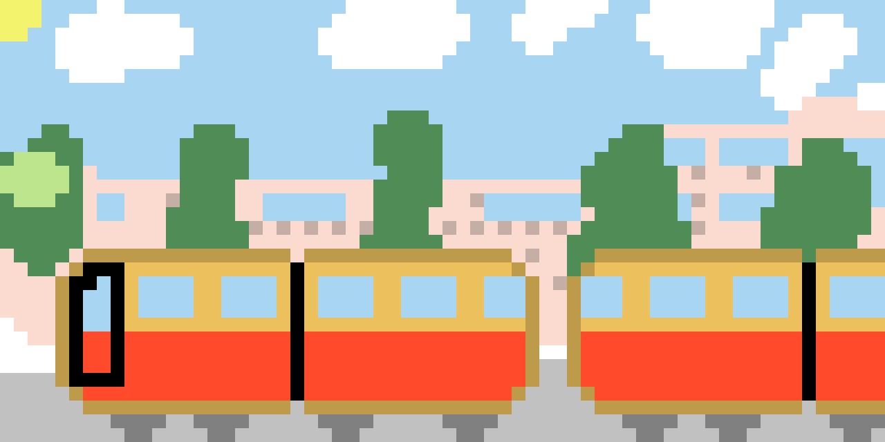
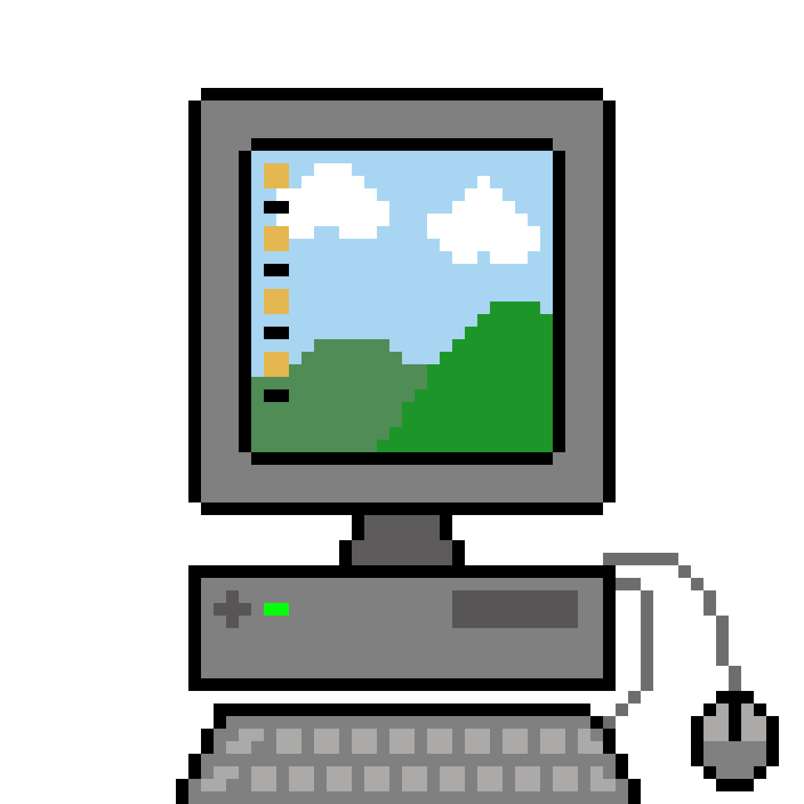
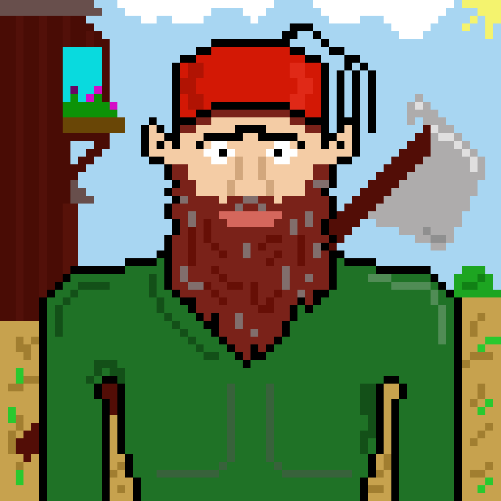
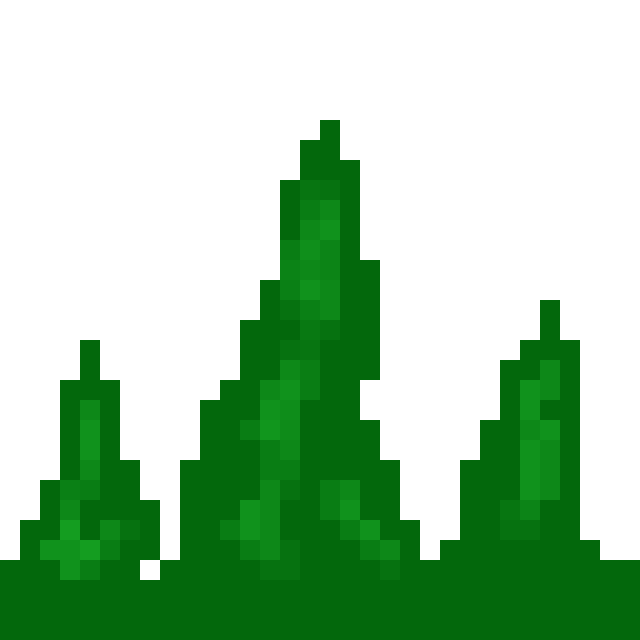
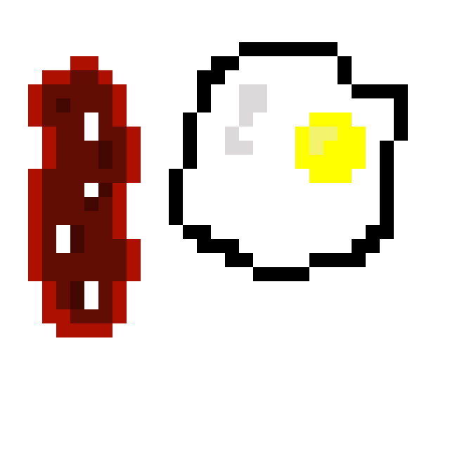
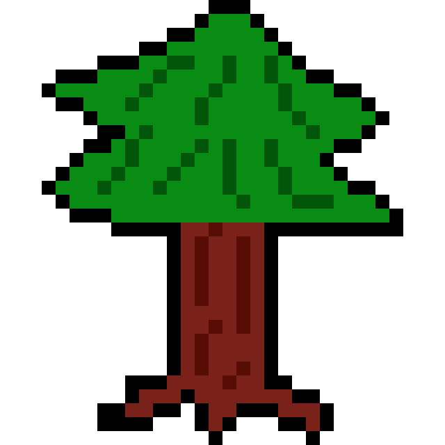
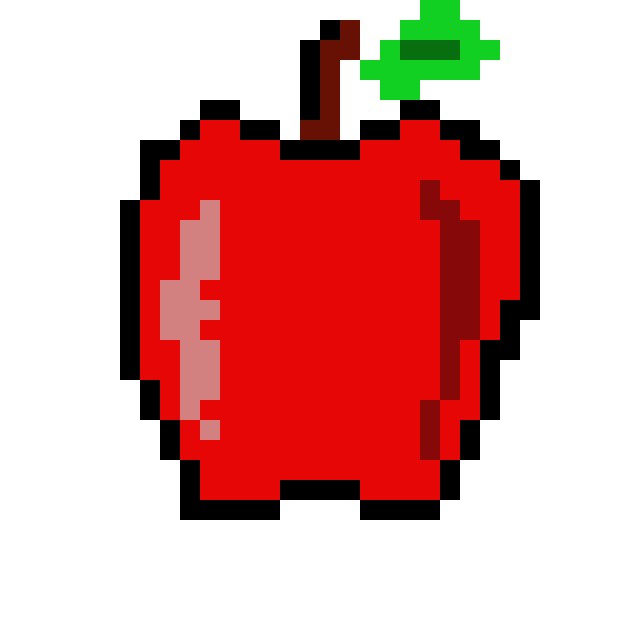
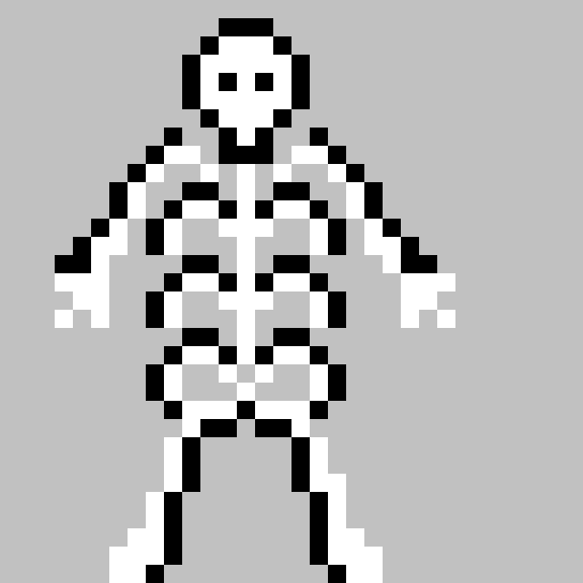
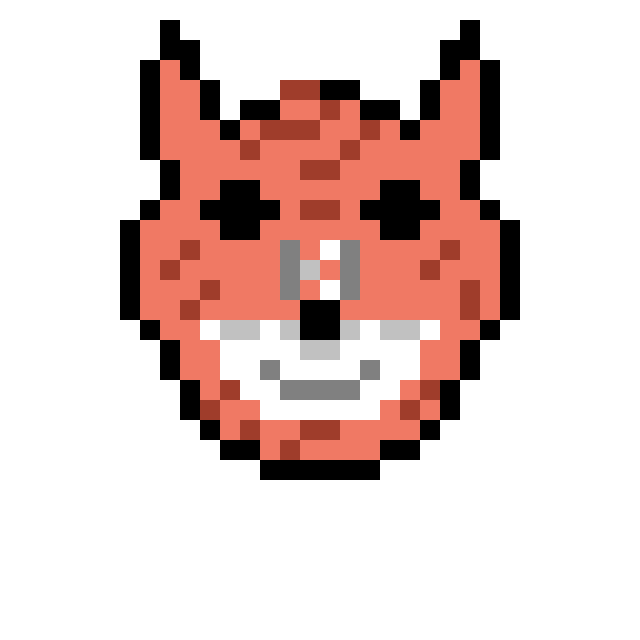

<<<tiny
title: Canburak Tumer's Devlog | Homepage
style: static/style/homepage.css
custom: static/analytics/analytics_combined.txt
tiny>>>

<!-- Google Tag Manager (noscript) -->
<noscript><iframe src="https://www.googletagmanager.com/ns.html?id=GTM-M2DS62Q3"
height="0" width="0" style="display:none;visibility:hidden"></iframe></noscript>
<!-- End Google Tag Manager (noscript) -->

# Devlog of Cardboard Cars by [Canburak Tümer](https://canburaktumer.com)

This page is to document my journey for my first ever commercial game development exercise. I will share some notes on development in posts and some grpahics I hand craft under Pixel Art sections.

All links are ordered in reverse chronogical order.

## [Blog Posts]
2025-07-05 - [Still Shaving the Yak](posts/article/yak_shaving.html)

## [Pixel Art]

All arts below are hand crafted by me either using Resprite on tablet or Aseprite on desktop computer. Exports are in 20x scale unless explicitly stated the another scale

| Date Created |Thumbnail | Name | Size (WxH) | Animated (T/F) |
|--------------|----------|------|------------|----------------|
| 2025-07-04 || [Sonnie](posts/art/sun_v1.html) | 32x32 | True |
| 2025-06-29 || [Sbahn](posts/art/sbahn.html) | 64x32 | False |
| 2025-06-29 || [Avatar State](posts/art/aang.html) | 32x32 | False |
| 2025-06-28 || [BSOD](posts/art/pc_v1.html) | 64x64 | True |
| 2025-06-24 || [Ottoman Dwarf](posts/art/dwarf_v1.html) | 64x64 | False |
| 2025-06-25 || [Grass in the Wind](posts/art/grass.html) | 32x32 | True |
| 2025-06-25 || [Medicines](posts/art/tablets.html) | 16x16 & 32x32 & 64x64 | False |
| 2025-06-25 || [Big Blue Ball](posts/art/world.html) | 64x64 | False |
| 2025-06-25 || [Breakfast](posts/art/bacon_v1.html) | 32x32 | False |
| 2025-06-24 || [Pine Tree](posts/art/tannenbaum_v1.html) | 32x32 | False |
| 2025-06-24 || [Apple](posts/art/apple_v1.html) | 32x32 | False |
| 2025-06-24 || [Skeleton](posts/art/skeleton_v1.html) | 32x32 | False |
| 2025-06-24 || [Fox](posts/art/fox_v1.html) | 32x32 | False |
| 2025-06-24 || [Airplane](posts/art/plane_v1.html) | 32x32 | False |
| 2025-06-24 || [Duckie](posts/art/duckie.html) | 16x16 | False |

Website colors are inspired by the [Fresh Ink Palette](https://lospec.com/palette-list/fresh-ink) by [Jude Buffum](https://lospec.com/judebuffum).

<a href="#" class="termly-display-preferences">Consent Preferences</a> - <a href="static/analytics/policy.html" class="termly-display-preferences"> Cookie Policy</a>
