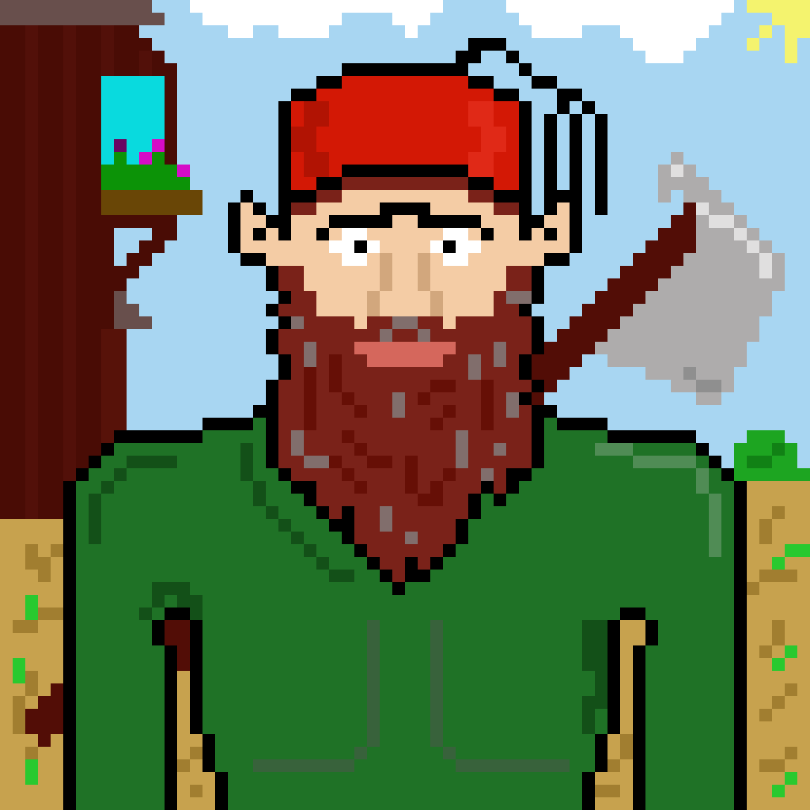

<<<tiny
title: Ottoman Dwarf | Canburak Tumer's Devlog
style: ../../static/style/pixel-art.css
custom_head: static/analytics/analytics_combined.txt
custom_body_start: static/html/page_body_start.html
tiny>>>

### Description
Sooo, we are starting a new FRP campaign in a setup that takes place in 18th century Istanbul. And I decided to play as a Barbarian Dwarf, of course I'd wear Fas and carry an axe on my back. What else would you expect?

## Image
