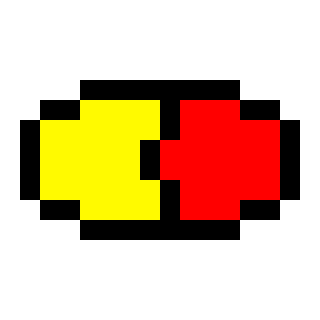
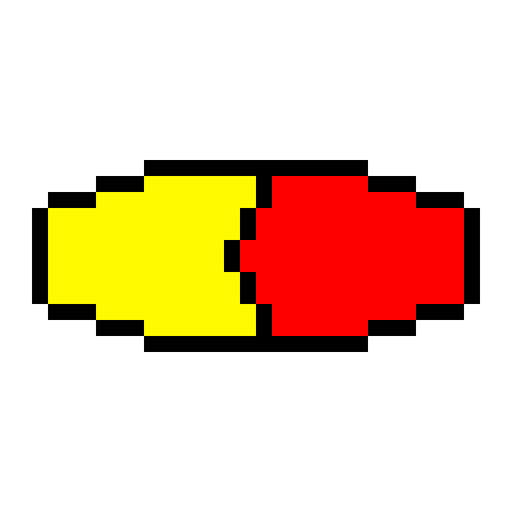

<<<tiny
title: Canburak Tumer's Devlog | Tablets
style: ../../static/style/pixel-art.css
tiny>>>

## Image

### Description
Same tablet on different resolutions, an experiment for me to see how canvas sizes effect my work. For example I learnt that 128x128 does not fit on my tablet's screen comfortably.