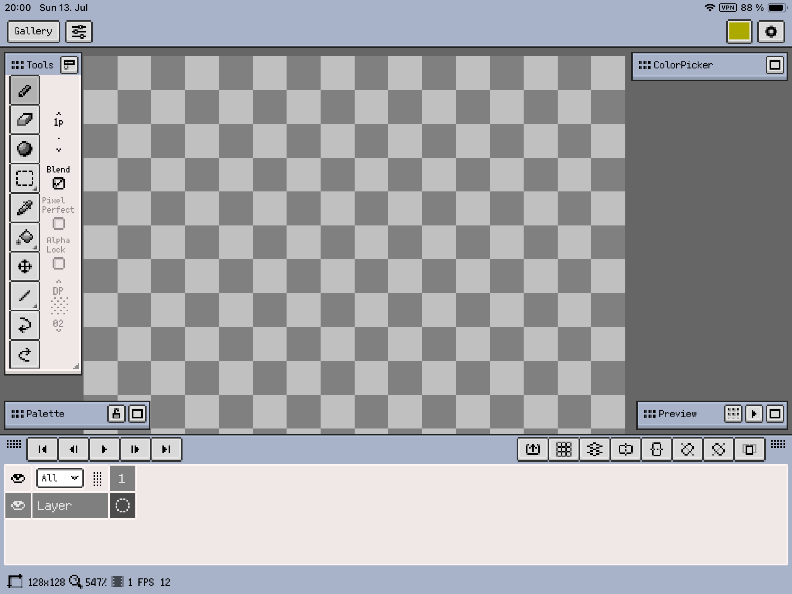
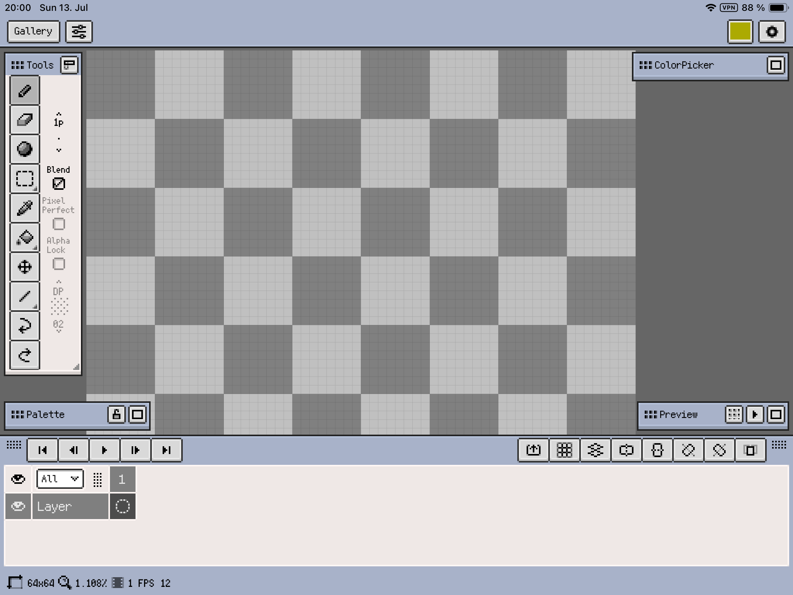

<<<tiny
title: My Ideal Canvas Size | Canburak Tumer's Devlog
style: ../../static/style/blog.css
custom_head: static/analytics/analytics_combined.txt
custom_body_start: static/html/page_body_start.html
tiny>>>

## What is my ideal canvas size

When I first downloaded the [Resprite App](https://resprite.fengeon.com/) on my table to start my journey on pixel art. I did not think about the canvas sizes. All I thought was creating something and spending my time on creating.

Then on the "New Sprite" dialog window, it asked for the canvas size to create. I wanted it to be as small as possible, so I can still keep the pixel art feeling but also not too small so I can have some details. I am a newbie on this, and trying to compress the details is actually opening space for mistakes and shapes that are not looking like what I dreamt.

So I tried the 16x16 first, which worked well for [duckie](../art/duckie.html), then I scaled 32x32 and then 64x64 to test out them. Finally I created a canvas that is 128x128 and I deleted the file right after creating it. Why? Let me show you.

As a newbie, I want to see the whole canvas on the screen so I can work on the full image. Working on smaller sections can be something I will do in the future, but at the moment to keep the colors, lines, perspective, shadows and all other things aligned I need to see the whole image. Also gridlines on the canvas helps me to think and plan easier. So 128x128 was a no-go. At least on the tablet I have. If you look at the following image, you might get the idea of gridlines.

Then I scaled even one more step down. Because 64x64 was just [too big for me](https://www.youtube.com/shorts/iT74VY-h_k0), it requires more attention to detail and better knowledge of color usage etc. On 32x32 level "compression" actually helps with this. Anything that is smaller than 32x32, a newbie like me can easily drop the details that actually gives life to the image and I want to avoid that. 

As of this writing on this devlog, I have:  
- 2 16x16  
- 11 32x32  
- 4 64x64  
images.

Meanwhile I still continue to watch pixelart related videos on YouTube and one of the most popular canvas size for tiles or character sprites is 32x32. That seems like a sweet spot. For the card game I am planning, I am using a 57x89 canvas size though, as this is one of the most common size for playing cards in milimeters. I just translate milimeters to pixels and drawing on that dimensions.

So that's my take on canvas sizes for pixel art, for now. I know there is no one size fits all solution here. You can let me know your thoughts on [BlueSky](https://web-cdn.bsky.app/profile/did:plc:zxbywmgqqwgaotv5xvp63cdn)

Until next post, keep gaming!